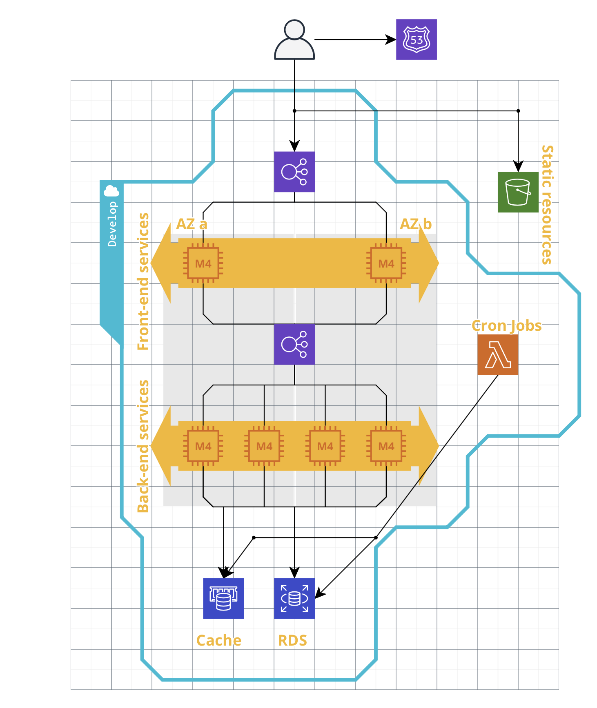

[DEMO](https://stark-escarpment-52058.herokuapp.com)

# Specifications
1. Create a landing page which allows users to login with Twitch.
2. Ask for only those permissions which are required.
3. On successful login, keep the session active for 7 days.
4. Save user's name, email, thumbnail url in users table and scopes and auth token in a separate table.
5. Show a second view asking for your favourite streamer's name.
6. Show embedded Twitch Player and Chat on page.
7. Add a button which gives you the option to create a clip of the current stream.
8. Save clip info in the database. On the next reload, it should show all the clips created by currently logged in user for that streamer.
9. Make a cron which runs every day at 12 AM and updates the view count of all the clips from Twitch API.
10. Write 2 queries 
     - Show total number of views for your created clips.
     - Show total number of views for each streamer created by your user.

# Known problems
1. Job which responsible for view updates doesn't support pagination, since Twitch API supports only 100 clip IDs in request,
this should be redesignScreenshot 2020-08-10 at 15.07.08
2. Jobs should be run as separate application
3. Need to read configs from file and secrets instead of hardcoding them
4. Application should be run in docker
5. Should use microservices, since load would be different for clip, streamer and user functionality. Obviously clip and 
streamer would have more requests than user functionallity
6. Logging should be improved
7. View count updating should be done in transactions 
8. View count should be cached, since we update it in cron job
9. Error codes should be improved
10. Error messages should be improved
11. Token refreshing both for Twitch API and our JWT token

# Architecture

* Scalling group used for both front-end and back-end services
* ELB takes care of incoming traffic into front-end services and into back-end services
* RDS used as primary database(could be servreless or master-slave)
* Memcached(Redis) used for caching, for example views count
* S3 used for static resources
* Route 53 used as DNS manager
* EC2 Scalling groups could be replaced by EKS/ECS/Fargate
* AWS Lambda for cron Jobs

# Bottlenecks
* Dependency on third-part API(Twitch) which has global rate limits
* SQL database, which harder to scale, so could look into DynamoDB
* Correct scalling strategy is a must. So should found balance between cost and response time.

In general, this architecture has enough scallability to handle millions of requests. But dependency on 
Twitch API should be handled correctly, since they have strong global rate limits, so this could affect on user expereince.
Also in case of 900MM req/day need to work on code optimization(profilling, benchmarks) and on scalling configuration, since 
I guess that we will have pick hours at which we will need in short terms scale in X times and after pick hours we will need
to scale back for saving moneys. So for this we could configure scalling group to use some percentage of Spot instances.
